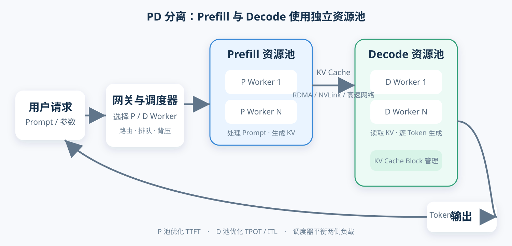

## 先说结论

PD 分离中的 `P` 是 Prefill，`D` 是 Decode。

普通推理服务让同一组 GPU 同时处理“读问题”和“逐字回答”；PD 分离则把两个阶段放到不同的 GPU 实例或资源池中：

```text
长 Prompt → Prefill 节点 → 传输 KV Cache → Decode 节点 → 逐 Token 输出
```

这样做不是为了减少模型计算总量，而是为了隔离两种完全不同的负载：

- Prefill 计算密集，关心多久生成第一个 Token。
- Decode 访存密集，关心后续 Token 输出是否稳定。

分开以后，两边可以使用不同的 GPU 数量、并行策略、批处理方式和扩缩容策略。但代价是必须跨设备传输 KV Cache，还要引入路由、调度和故障恢复机制。

因此，PD 分离不是“打开后一定更快”的开关。它可以提高GPU资源利用率，更适合高并发、长 Prompt、长输出、且对首 Token 和逐 Token 延迟都有明确要求的生产服务。

## 一次大模型推理分成两个阶段

### Prefill：把问题一次读完

用户输入 Prompt 后，模型会并行处理全部输入 Token：

```text
输入：请根据下面 20 页材料生成一份总结……
                         ↓
→ 算出所有 token 的 Q、K、V
→ 用 Q 和 K 算注意力权重
→ 用权重对 V 加权求和，得到输出
                         ↓
生成1.第一个 Token，2.得到各个token的 KV Cache（profill阶段是KV Cache的生产者，KV Cache 只存 K 和 V 这两个向量本身，不存 Q，不存 Q 与 K 的计算（点积），也不存加权求和的结果。）
```

Prompt 越长，Prefill 的矩阵计算越大。这个阶段通常更容易吃满 GPU 的计算单元，主要表现为计算密集型负载。

用户感受到的核心指标是：

```text
TTFT = Time To First Token
     = 从请求到达，到第一个输出 Token 出现的时间
```

TTFT 包括排队、Prefill 计算、调度和首 Token 返回等耗时。

### Decode：根据缓存逐字生成

Prefill 完成后，模型开始一个 Token 一个 Token 地生成回答：

```text
第 1 步 → 生成 Token 1
第 2 步 → 读取 KV Cache，生成 Token 2
第 3 步 → 读取 KV Cache，生成 Token 3
……
```

Decode 每一步只增加一个 Token，单步计算规模不大，但要持续读取模型权重和不断增长的 KV Cache，因此通常更受显存带宽和内存容量限制。

用户感受到的核心指标是：

```text
TPOT = Time Per Output Token 首 Token 之后平均每个输出 Token 的生成时间
ITL  = Inter-Token Latency 每生成下一个 token 平均需要等待多久。
```

它们描述后续 Token 的生成间隔，也就是回答“吐字”是否流畅。

## P 和 D 放在一起有什么问题

1.这叫 Prefill/Decode 干扰：

传统聚合式部署中，同一个推理实例同时处理 Prefill 和 Decode。

大 Prefill 任务计算量很高。如果它插入正在进行的 Decode 批次，其他用户的逐 Token 输出可能突然停顿。表现到界面上，就是回答生成到一半时偶尔卡一下。

2.两种阶段被迫共享同一套配置。

- Prefill 希望尽快吞下大量输入 Token，适合较大的计算批次。
- Decode 希望每轮快速完成，避免 Token 间隔变长。
- Prefill 可能需要更强的张量并行来压低 TTFT。
- Decode 更关心显存带宽、KV Cache 容量和同时服务的序列数量。

同一组 GPU 很难同时把两个目标调到最好。通常只能在 TTFT 和 TPOT 之间折中。

## PD 分离的完整架构



一次请求通常经历以下步骤：

1. 网关接收 Prompt、采样参数和请求 ID。
2. 调度器选择 Prefill Worker 和 Decode Worker。
3. Prefill Worker 计算输入 Token，生成第一个 Token 和 KV Cache。
4. KV Cache 通过高速链路发送给目标 Decode Worker。
5. Decode Worker 接管请求，继续逐 Token 生成。
6. 输出流通过网关返回用户。
7. 请求结束后回收两侧的缓存块和调度状态。

真正困难的不是把两个进程分别启动，而是让它们正确交接同一个请求。

## PD 分离能带来什么

### 1. 分别优化 TTFT 和 TPOT

P 池和 D 池可以使用不同配置：

| 配置项 | Prefill 池 | Decode 池 |
|---|---|---|
| 主要目标 | 压低 TTFT | 稳定 TPOT/ITL |
| 典型瓶颈 | 计算能力 | 显存带宽与 KV 容量 |
| 批处理侧重 | 批量输入 Token | 批量活跃序列 |
| 并行策略 | 可使用更大的 TP/PP | 按带宽和并发单独选择 |
| 扩容依据 | Prompt Token 排队量 | 活跃序列和输出 Token 负载 |

例如，业务突然出现大量长文档请求时，可以优先扩容 Prefill Worker，而不必同步增加 Decode Worker。

### 2. 降低尾部 Token 延迟

P 和 D 共卡时，一个超长 Prompt 可能让正在输出的请求产生明显卡顿。PD 分离后，Decode GPU 不再被大块 Prefill 工作抢占，更容易保持稳定的 Token 间隔。

这也是 vLLM 官方文档强调 PD 分离可独立调节 TTFT 与 ITL、控制尾部 ITL 的主要原因。

### 3. 独立选择硬件

两个阶段的瓶颈不同，可以进行异构部署：

- Prefill 使用算力更强、Tensor Core 性能更高的 GPU。
- Decode 使用显存容量和带宽更合适的 GPU。
- 长上下文业务为 P 节点配置更强的并行能力。
- 高并发长回答业务增加 D 节点数量和 KV Cache 空间。

硬件异构并非必需。即使使用相同 GPU，按角色拆池也能减少干扰并独立扩缩容。

### 4. 提高满足 SLO 的有效吞吐

只看每秒处理多少 Token 可能会掩盖用户体验问题。一个系统即使吞吐很高，如果大量请求 TTFT 或 TPOT 超标，实际可用能力仍然很低。

更适合衡量 PD 系统的是 Goodput：

```text
Goodput = 单位时间内满足 TTFT 和 TPOT 目标的请求数量
```

DistServe 的核心目标就是在同时满足两类延迟约束的前提下提高 Goodput，而不只是追求裸吞吐。

## PD 分离需要付出的代价

### KV Cache 传输开销

这是最直接的成本。Prompt 越长、层数越多、KV Head 越多，传输数据越大。跨节点网络较慢时，TTFT 可能因为 KV 迁移反而上升。

### 多保存一份模型权重

P Worker 和 D Worker 都需要执行模型计算，通常都要加载完整模型权重或各自的并行分片。与共卡部署相比，拆池可能增加模型权重副本和 GPU 资源碎片。

### 两边容易失衡

如果 P 池太小，会堆积 Prompt，TTFT 变差；如果 D 池太小，请求完成 Prefill 后只能排队等待 Decode，KV Cache 还会长期占用显存。

```text
P 太慢：请求堵在入口
D 太慢：KV Cache 堵在交接区
```

工作负载变化时，固定的 P:D GPU 比例很容易失效。因此生产系统需要根据 Prompt 长度、输出长度和并发量动态调度或扩缩容。

### 系统复杂度上升

系统需要额外处理：

- 全局请求 ID 和状态追踪。
- P/D Worker 发现与健康检查。
- KV Cache 地址和块元数据管理。
- KV 传输失败后的清理与重试。
- Worker 扩缩容时的路由更新。
- P 已完成但 D 失败时如何恢复。
- 跨版本、跨并行策略的 KV 布局兼容。

从“一个推理服务”变成“分布式状态交接系统”，运维复杂度会明显增加。

## 基于 vLLM 快速搭建 PD 分离推理

vLLM 从 v0.8 开始原生支持 PD 分离，核心是通过 `--kv-transfer-config` 参数指定 KV Connector 和节点角色。下面以 `Qwen/Qwen3-27B` 为例，演示一个最小可运行的 PD 分离 demo。

### 1. 安装依赖

```bash
pip install vllm nixl
```

`nixl` 是 vLLM 默认的 KV Cache 传输库（基于 RDMA / TCP），负责在 P 节点和 D 节点之间搬运 KV Cache。

### 2. 启动 Prefill 节点（Producer）

Prefill 节点负责处理输入 Prompt、生成第一个 Token 并产出 KV Cache。通过 `kv_role: kv_producer` 标记它为"生产方"：

```bash
vllm serve Qwen/Qwen3-27B \
  --port 8100 \
  --tensor-parallel-size 2 \
  --kv-transfer-config '{"kv_connector":"NixlConnector","kv_role":"kv_producer"}'
```

- `--tensor-parallel-size 2`：使用 2 张 GPU 做张量并行（按实际 GPU 数量调整）。
- `kv_role: kv_producer`：表示该节点完成 Prefill 后会把 KV Cache 发送给 Decode 节点。

### 3. 启动 Decode 节点（Consumer）

Decode 节点接收来自 Prefill 节点的 KV Cache，然后继续逐 Token 生成输出。通过 `kv_role: kv_consumer` 标记它为"消费方"：

```bash
vllm serve Qwen/Qwen3-27B \
  --port 8200 \
  --tensor-parallel-size 2 \
  --kv-transfer-config '{"kv_connector":"NixlConnector","kv_role":"kv_consumer"}'
```

### 4. 发送请求

请求发给 Prefill 节点。Prefill 完成计算后，KV Cache 通过 NixlConnector 自动传输到 Decode 节点，最终由 Decode 节点返回生成结果：

```bash
curl http://localhost:8100/v1/completions \
  -H "Content-Type: application/json" \
  -d '{
    "model": "Qwen/Qwen3-27B",
    "prompt": "请解释什么是 PD 分离推理",
    "max_tokens": 200
  }'
```

### 工作原理

```text
用户请求 → Prefill 节点 (kv_producer, port 8100)
             ↓ 计算 KV Cache
             ↓ 通过 NixlConnector 传输 KV Cache
           Decode 节点 (kv_consumer, port 8200)
             ↓ 逐 Token 生成
             ↓ 返回结果给用户
```

### 补充说明

- **单机 vs 多机**：上面的示例可以在同一台机器的两个终端分别启动。如果 P 和 D 在不同机器上，需要确保两台机器之间网络互通，NixlConnector 支持 RDMA 和 TCP 两种传输方式。
- **其他 Connector**：vLLM 还支持 `MooncakeConnector`（基于 Mooncake 传输库，适合大规模 RDMA 集群）等。生产环境可根据网络条件选择。
- **多 P 多 D**：生产环境通常部署多个 Prefill 和 Decode 节点，前面加一层路由/调度层（如自定义网关）将请求分发到合适的 P 节点，P 完成后再路由到 D 节点。

## 最后总结

PD 分离的本质是：**把计算密集的 Prefill 和带宽密集的 Decode 变成两个可以独立调度、优化和扩缩容的资源池。**

它解决三个主要问题：

1. 避免大 Prefill 阻塞正在进行的 Decode。
2. 分别优化 TTFT 和 TPOT。
3. 根据输入与输出负载独立配置资源。

它也引入三个新问题：

1. KV Cache 跨设备传输。
2. P/D 资源池容易失衡。
3. 调度、容错和监控更复杂。

所以，正确的选型顺序不是“听说 PD 分离更快就直接上”，而是：

```text
先测聚合部署
  → 确认 P/D 干扰
  → 测 KV 传输成本
  → 按 SLO 压测 PD 方案
  → 比较 Goodput 和每请求成本
```

只有当拆分带来的隔离收益大于 KV 迁移与系统复杂度时，PD 分离才真正值得。

## 参考资料

- [DistServe: Disaggregating Prefill and Decoding for Goodput-optimized LLM Serving](https://arxiv.org/abs/2401.09670)
- [Mooncake: A KVCache-centric Disaggregated Architecture for LLM Serving](https://arxiv.org/abs/2407.00079)
- [vLLM：Disaggregated Prefilling](https://docs.vllm.ai/en/latest/features/disagg_prefill/)
- [TensorRT-LLM：Disaggregated Serving](https://nvidia.github.io/TensorRT-LLM/features/disagg-serving.html)

