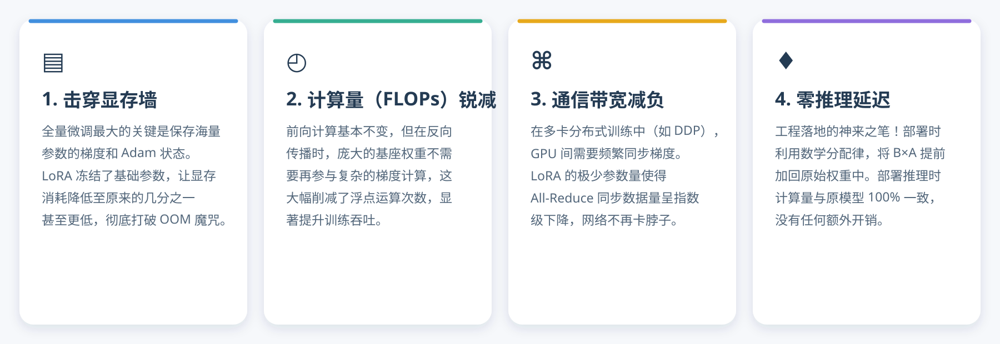
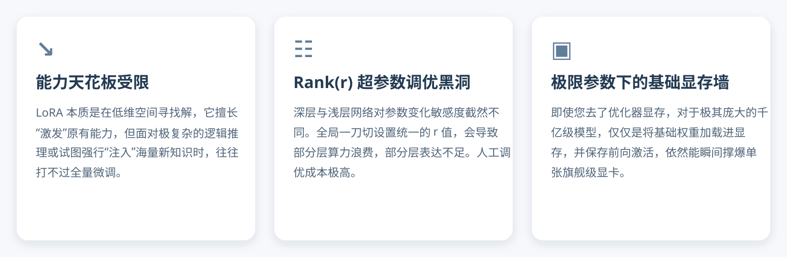
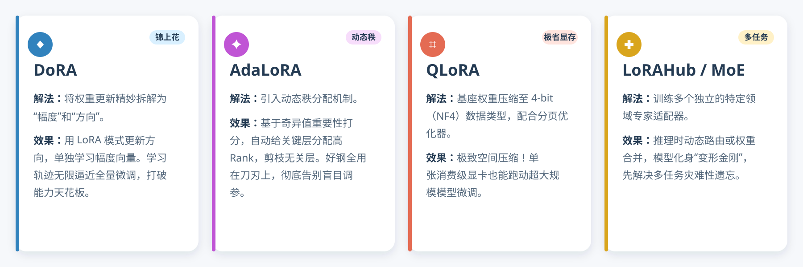
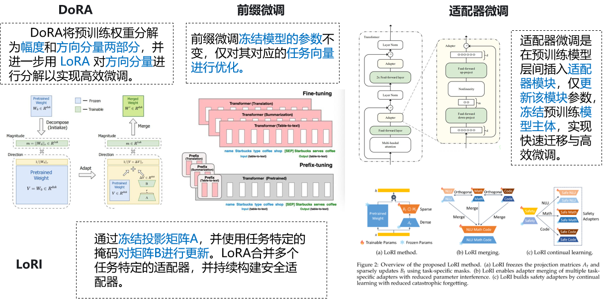

## 为什么不直接做全参数微调

全参数微调很直接：把模型里的全部参数设为可训练，再用新数据更新整个模型。这种方式表达能力强，但成本也非常高。

训练时，显存里不只要放模型权重，还要保存梯度、优化器状态和中间激活。一个原本勉强能放进显存的模型，一旦开始全参数训练，所需显存可能成倍增加。

它主要有四个痛点：

1. **显存压力大**：所有权重都参与训练，还要保存相应的梯度和优化器状态。
2. **计算成本高**：反向传播需要计算整个模型的梯度，训练时间和用卡成本都很高。
3. **多卡通信重**：分布式训练需要同步大量梯度或参数，网络带宽容易成为瓶颈。
4. **部署不灵活**：每个任务都会产生一份完整模型，保存、传输和切换的成本都很高。

例如，为“客服问答”和“公路执法报告”分别做全参数微调，通常要保存两份完整模型。模型越大、任务越多，这种方式越难维护。

## LoRA：不重练整个模型，只记录改动

LoRA 的全称是 Low-Rank Adaptation，也就是低秩适配。

它冻结原模型权重 `W`，增加两个小矩阵学习权重变化 `ΔW`：

```text
W' = W + ΔW
ΔW ≈ BA
```

如果原权重矩阵是 `4096 × 4096`，完整微调需要更新约 1678 万个参数。假设 LoRA 的 Rank 为 8，只需要训练：

```text
4096 × 8 + 8 × 4096 = 65,536
```

这就像不去重写整本书，只单独保存一份“修改说明”。基础模型保留通用能力，LoRA 适配器只记录某项任务需要增加和调整的部分。

## LoRA 的主要优势



*图 1：LoRA 的四项主要优势。*

### 显存占用更低

基础模型权重被冻结后，不需要为全部参数保存梯度和优化器状态。真正参与训练的只有体积很小的 LoRA 参数，因此训练显存明显下降。

### 训练计算更集中

前向计算仍然需要经过基础模型，但反向传播不再更新全部权重，训练工作集中在 LoRA 旁路上，整体训练成本通常低于全参数微调。

### 多卡通信量更小

在需要同步可训练参数或梯度的并行方案中，LoRA 通常需要同步更少的数据。不过实际收益取决于 ZeRO、FSDP、张量并行等具体方式，不能理解成通信量一定按相同比例下降。

### 部署和切换更灵活

一个基础模型可以挂载多个小型 LoRA 适配器。不同任务之间切换时，不必复制和加载多份完整模型，适合多业务场景。

## LoRA 也不是万能的



*图 2：LoRA 的三个典型不足。*

### 表达能力受 Rank 限制

LoRA 假设任务所需的权重变化可以用低秩矩阵近似。这个假设在许多任务上有效，但遇到差异很大的新领域或复杂任务时，较低的 Rank 可能装不下足够的信息，效果容易碰到上限。

### Rank 很难一次选对

Rank 越大，表达能力通常越强，但参数量、显存占用和过拟合风险也会增加。普通 LoRA 经常给多个目标层设置相同 Rank，可不同层对任务的重要程度并不相同，统一设置容易浪费参数预算。

### 基础模型本身仍要加载

LoRA 减少的是可训练参数、梯度和优化器状态。被冻结的基础模型权重依然需要放进显存。如果基础模型本身就放不下，只用普通 LoRA 仍然解决不了问题。

## 围绕 LoRA 出现了哪些改进



*图 3：几类 LoRA 改进方法分别解决不同问题。*

### QLoRA：先把基础模型压小

QLoRA 使用 4 bit 等低精度形式保存冻结的基础模型，再训练 LoRA 适配器。它主要解决“基础模型权重太大、显存放不下”的问题。

QLoRA 不是把所有训练计算都变成 4 bit，也不是把 LoRA 参数简单压成 4 bit。训练时通常仍需反量化，并用较高精度完成部分计算，所以它节省显存，但不一定训练得更快。

### DoRA：把幅度和方向分开学

DoRA 将权重变化拆成 magnitude（幅度）和 direction（方向）。方向部分继续用 LoRA 的低秩形式学习，幅度则由单独的参数学习。

用白话说，LoRA 主要告诉模型“往哪个方向改”，DoRA 还进一步告诉模型“这个方向要改多大”，目的是缩小低秩微调与全参数微调之间的效果差距。

### AdaLoRA：把 Rank 分给更需要的层

AdaLoRA 不让所有层一直使用同一个 Rank，而是在训练过程中根据重要程度动态分配有限的 Rank 预算。重要层保留更多容量，不重要层减少容量。

它解决“统一 Rank 不够合理”的问题，但也增加了训练调度和参数配置的复杂度。

### LoRAHub 与 MoE：让多个适配器协作

当系统积累了很多任务适配器后，可以进一步组合、路由或融合。LoRAHub 尝试组合已有 LoRA，MoE 思路则根据输入选择合适的专家或适配器。

它们关注的不只是“怎样训练一个 LoRA”，而是“怎样管理和复用一组 LoRA”。多任务适应更加灵活，但路由、融合和线上管理也更复杂。

## 其他微调方法



*图 4：DoRA、前缀微调、适配器微调和 LoRI *

### 前缀微调

前缀微调冻结模型参数，只训练一组任务向量，并把它们加入模型的注意力计算。可以把这些向量理解成模型内部长期携带的一段“软提示词”。

### Adapter 微调

Adapter 微调在 Transformer 层之间插入小型瓶颈网络，只更新这些新增模块。它的任务边界比较清楚，但主干中多了额外计算路径，推理时可能增加延迟。

### LoRI

LoRI 通过冻结投影矩阵，只更新与任务对应的低维表示，并尝试在多个任务之间共享部分结构。它同样在探索怎样用更少参数适应新任务，只是参数组织方式与 LoRA 不同。

这些方法没有简单的上下级关系。它们是在不同位置、用不同方式减少可训练参数，并分别处理表达能力、显存、任务切换和持续学习等问题。

## 实际应该怎么选

| 当前问题 | 优先考虑 |
|---|---|
| 想建立简单可靠的参数高效微调基线 | LoRA |
| 基础模型权重放不进显存 | QLoRA |
| 低 Rank 下效果不足，又不想大幅提高 Rank | DoRA |
| 参数预算固定，但不同层的重要性差异明显 | AdaLoRA |
| 已有多个任务适配器，希望组合或动态选择 | LoRAHub、MoE 或适配器路由 |
| 希望任务模块边界清晰，接受额外推理路径 | Adapter |
| 主要希望用可学习提示影响模型 | 前缀微调 |

建议先用 LoRA 建立基线，再根据明确瓶颈选择改进方法。评测时同时记录任务指标、峰值显存、训练时间、适配器大小和推理速度，不能只比较训练 Loss。

## 最后总结

全参数微调的问题不是效果差，而是成本太高：显存、计算、多卡通信和模型管理都会变重。

LoRA 用低秩矩阵记录任务所需的权重变化，大幅减少可训练参数，并让一个基础模型复用多个任务适配器。但它仍受到 Rank 表达能力、Rank 分配方式和基础模型显存占用的限制。

QLoRA、DoRA、AdaLoRA 等方法是在 LoRA 的基础上，分别解决“基础模型太大”“低秩表达不足”和“Rank 分配不合理”等问题。选型的关键不是追求更新的名字，而是先确认自己真正遇到的瓶颈。
