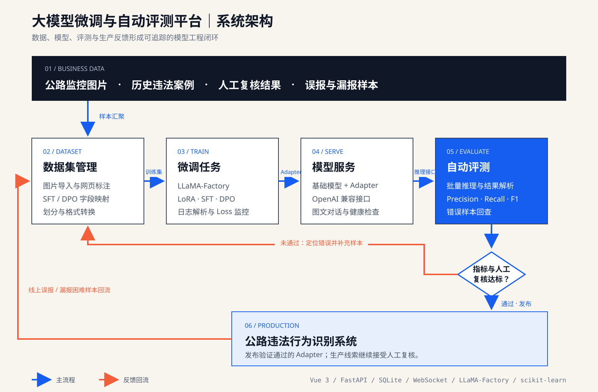
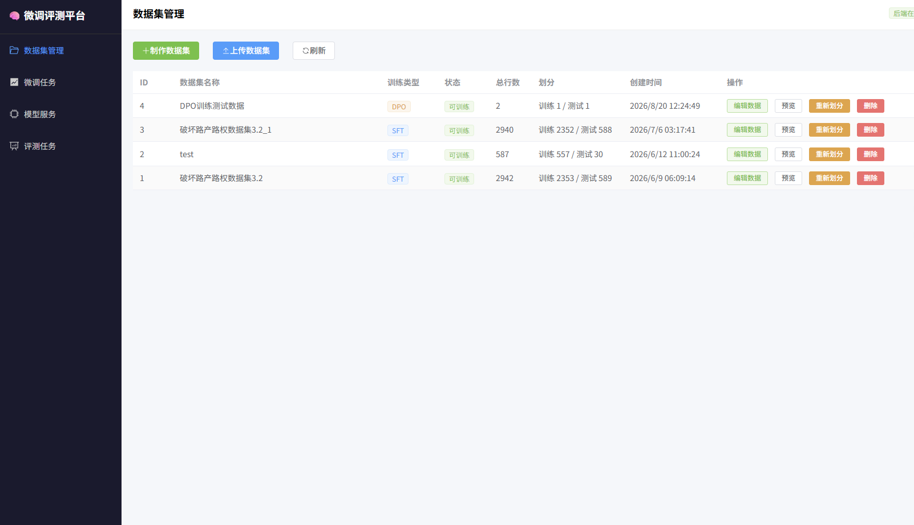
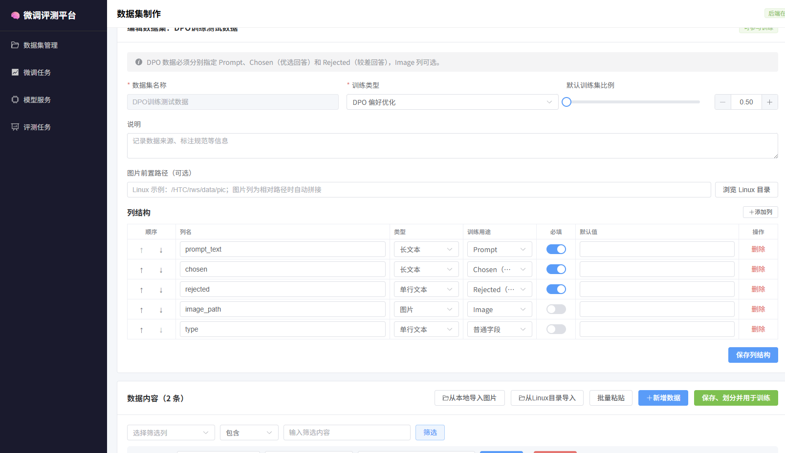
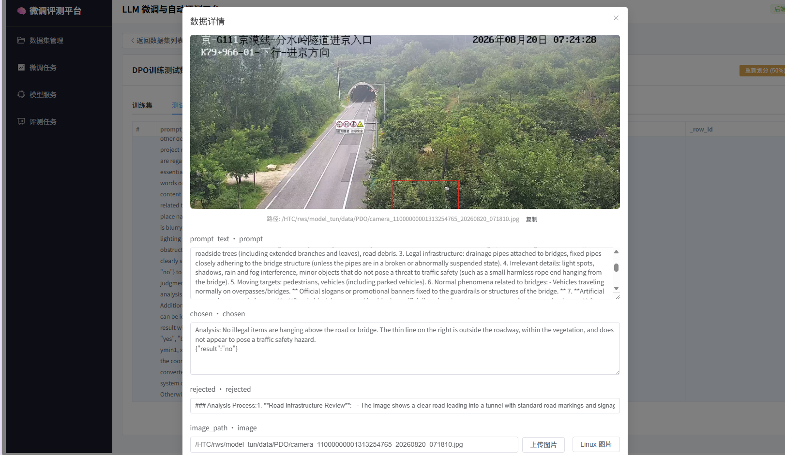
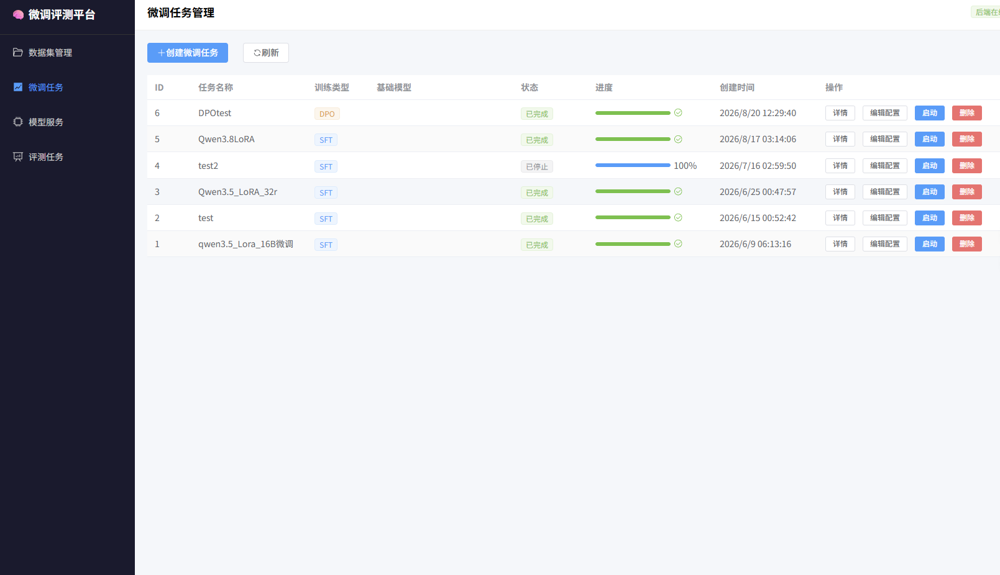
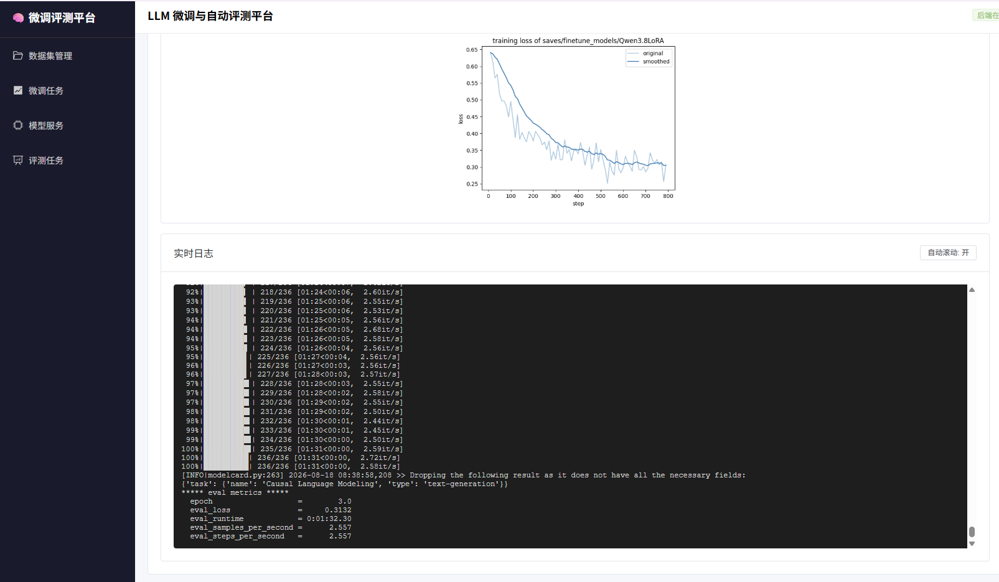
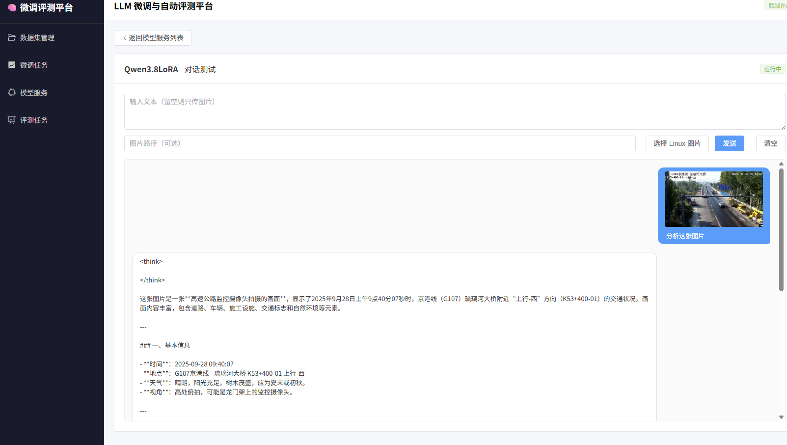
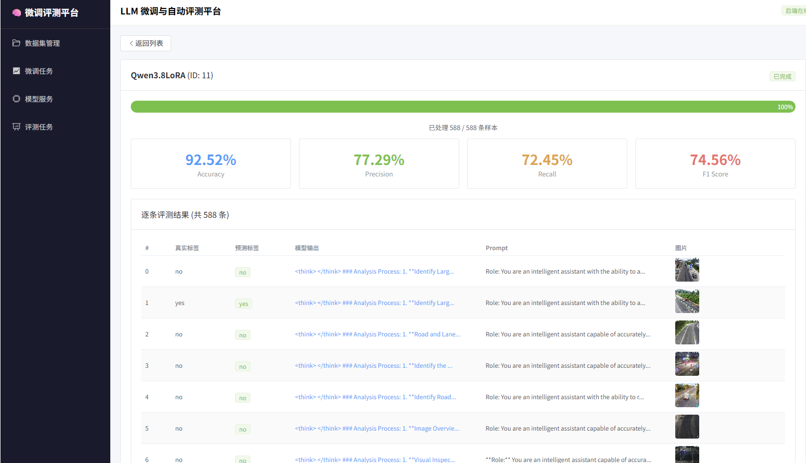
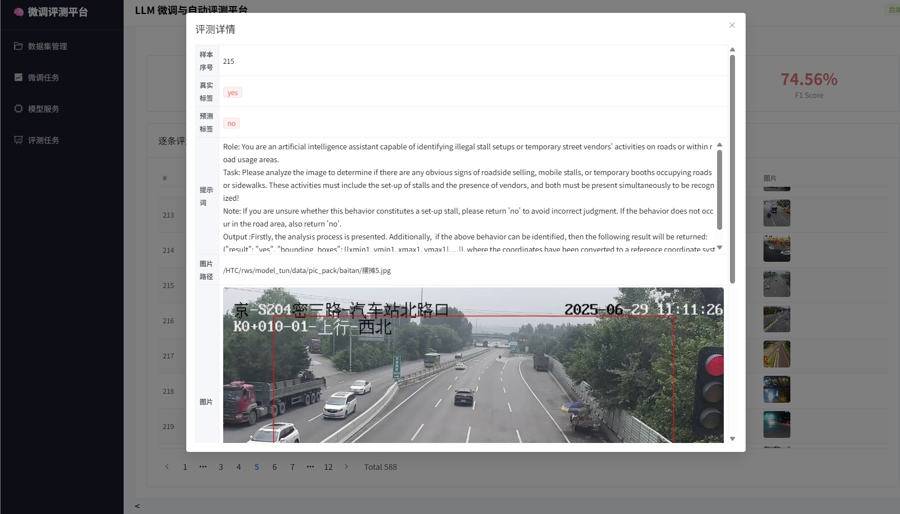
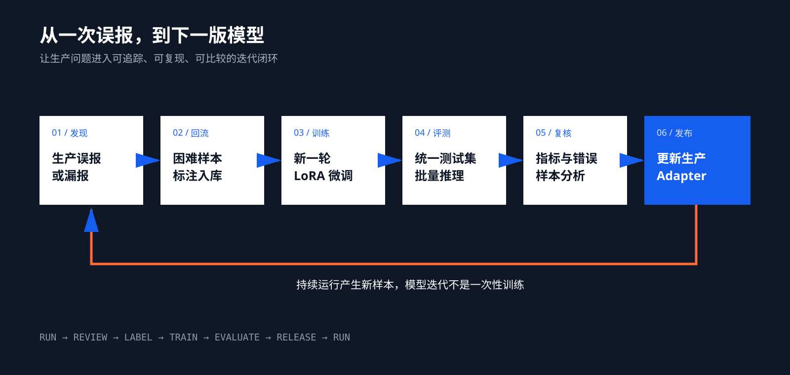

在公路违法行为识别系统中，模型上线不是终点。监控画面不断变化，新的误报和漏报会持续出现：正常行驶的黄色货车可能被当作施工机械，护栏可能被理解成围挡，合法交通标志也可能与非公路标志混淆。

真正困难的不是再执行一次训练脚本，而是把人工复核中发现的问题稳定地转化为下一版模型：样本从哪里来、如何标注、使用哪份配置训练、新模型是否优于旧模型、哪些类别得到改善、哪些错误仍然存在，都需要留下可追踪的依据。

因此，我为前期建设的公路违法行为识别系统开发了一套大模型微调与自动评测平台，将**数据集制作、SFT/DPO 微调、训练监控、模型服务和批量评测**连接成统一工作流。平台的目标不是替代算法判断，而是让模型迭代变得可管理、可复现、可比较。

> 生产系统负责发现疑似违法线索；微调评测平台负责把生产问题转化为数据、模型和可以验证的改进。

## 01｜项目背景：为什么不能只靠训练脚本

公路违法识别面对的是高度开放的真实环境。同一种违法行为可能出现在白天、夜间、雨雪、逆光和远距离画面中；同一个目标在不同摄像头下也会有完全不同的尺度与视角。仅靠通用视觉大模型和提示词，很难覆盖全部边界情况。因此我们引入了模型微调。

但项目中模型微调涉及到多个环节：人工整理 CSV、复制图片、编写 LLaMA-Factory YAML、在服务器启动训练、手动加载 Adapter，再用脚本逐条测试。这套方式能够完成实验，但存在几个明显问题：

- 数据集结构和图片路径容易因环境变化而失效；
- 训练配置散落在文件中，难以对应具体模型版本；
- 长时间训练只能通过终端查看，任务状态不直观；
- 基础模型和微调模型缺少统一的验证入口；
- 评测指标与错误样本分离，知道分数下降却难以定位原因。

平台由此沿着一条主线设计：从真实业务问题出发，用同一套系统完成数据回流、模型训练、服务验证和自动评测，并把结果重新反馈到生产系统。

## 02｜总体架构：贯通数据、训练、服务与评测

平台采用前后端分离架构。前端使用 Vue 3、TypeScript、Element Plus 与 ECharts，负责数据编辑、任务配置、实时状态和结果展示；后端使用 FastAPI、SQLAlchemy 与 SQLite，管理数据集、训练任务、模型服务和评测记录。

模型训练由 LLaMA-Factory 执行。后端以独立进程启动任务，持续解析日志，并通过 WebSocket 将进度、Step 和 Loss 推送到前端。训练完成后，可以将基础模型与 LoRA Adapter 组合为 OpenAI 兼容的推理服务，再由评测模块使用测试集逐条请求模型并计算指标。

| 模块 | 主要职责 | 关键实现 |
|---|---|---|
| 数据集管理 | 导入、标注、划分和转换数据 | CSV、图片相对路径、Schema、LLaMA-Factory JSON |
| 微调任务 | 生成配置并执行训练 | SFT、DPO、LoRA、YAML、子进程 |
| 训练监控 | 展示训练状态和 Loss | 日志解析、WebSocket、ECharts |
| 模型服务 | 加载基础模型与 Adapter | OpenAI 兼容接口、端口分配、健康检查 |
| 自动评测 | 批量推理和错误分析 | Accuracy、Precision、Recall、F1、结果 CSV |

## 03｜数据集管理：把业务样本变成可训练数据

数据集模块既支持上传现有 CSV，也支持直接在网页中创建数据。每个数据集都有独立的字段结构，可以设置列名、字段类型、是否必填、默认值及其训练用途。

图中公路违法数据集共有 2,940 条样本，按照 80%/20% 划分为 2,352 条训练数据和 588 条测试数据。平台将划分结果、字段定义和转换后的训练文件保存在同一数据集目录中，微调任务可以直接引用，不再依赖人工拼接路径。

对于多模态数据，最容易出问题的是图片管理。平台支持从本地浏览器上传图片，也支持浏览管理员授权的 Linux 服务器目录，直接引用服务器上的既有图片。数据内部保存相对路径，迁移到不同服务器时只需调整图片前缀，不必逐条修改 CSV。

### 从 SFT 扩展到 DPO

SFT 数据通常映射为 Prompt、Answer 和 Image；DPO 则需要 Prompt、Chosen、Rejected，并可选关联图片。平台在数据集创建阶段明确训练类型，并校验必需字段，避免将普通监督数据误用于偏好优化。

在公路识别任务中，一条 DPO 样本可以同时记录更符合执法口径的优选回答和容易产生误导的较差回答。例如，画面中虽然存在细线或悬挂物，但它位于道路外侧且不构成交通风险，优选回答应结合位置和风险条件输出 `no`，而不是只因为“看见线状物体”就判定违法。

数据保存后，平台会自动完成训练集与测试集划分，并生成 LLaMA-Factory 使用的 `data.json` 和 `dataset_info.json`。这样，数据制作与训练配置之间有了明确接口。

## 04｜微调任务：从表单配置到可复现训练

微调任务页面用于管理每一轮模型实验。创建任务时选择数据集、基础模型、模型模板和训练阶段，并配置 LoRA Target、输出目录以及主要训练参数。平台根据表单生成 YAML，同时保留完整编辑能力，既降低常规配置成本，也不限制高级参数调整。

平台当前支持两类训练流程：

- **SFT**：使用人工标注的标准回答，让模型学习公路违法行为的成立条件、排除条件和结构化输出协议；
- **DPO**：使用成对的优选与较差回答，让模型进一步偏向更符合业务口径的判断方式。

模型参数采用 LoRA 方式更新。底座模型保持冻结，仅训练注入到注意力层或前馈层中的低秩参数，因此可以用较少显存完成行业适配，并以独立 Adapter 的形式保存和部署。不同任务的 YAML、状态、日志和输出目录都由平台记录，模型版本不再只剩一个难以追溯的权重文件夹。

## 05｜训练监控：让长时间任务不再是黑盒

训练启动后，后端创建独立进程并持续读取标准输出。日志解析器从不同格式的训练日志中提取当前 Step、总 Step、Epoch、Loss 和完成状态，再通过 WebSocket 推送到任务详情页。

这轮训练中，Loss 从约 0.64 逐步下降到约 0.31。曲线同时保留原始值和平滑值：原始值用于观察局部波动，平滑值用于判断整体收敛趋势。页面下方保留实时日志，便于确认训练速度、剩余时间以及最终评估结果。

训练任务支持启动、停止和重新执行。即使页面刷新或 WebSocket 重新连接，后端数据库仍保存最新状态，前端可以恢复任务进度，而不是把浏览器连接状态误认为训练进程状态。

## 06｜模型服务：先人工验证，再批量评测

模型完成微调后，可以在平台中创建推理服务。服务配置包括基础模型路径、LoRA Adapter、模型模板和最大输出长度；后端从指定端口范围内自动选择可用端口，启动 LLaMA-Factory API，并通过健康检查确认模型是否真正可用。

平台提供简单的图文对话页面。它不是面向最终用户的聊天产品，而是正式评测前的验证入口：检查图片是否能够读取、模板是否匹配、Adapter 是否正确加载，以及模型输出是否符合预期格式。

对于公路场景，这一步尤其重要。模型不仅要返回 `yes` 或 `no`，还应说明画面依据，并在命中目标时给出结构化位置。人工冒烟测试能够在批量消耗测试集之前发现路径、模板和输出协议问题。

## 07｜自动评测：分数之外，还要能回到错误样本

评测任务选择一个已经启动的模型服务和一份测试集，随后逐条调用模型接口。每条样本都会记录真实标签、预测标签、模型原始输出、Prompt 和图片路径；结果实时写入 CSV，即使任务中途停止，已完成部分也不会全部丢失。

本次展示的评测共处理 588 条测试样本，结果为：

| 指标 | 结果 | 在业务中的含义 |
|---|---:|---|
| Accuracy | 92.52% | 全部样本中预测正确的比例 |
| Precision | 77.29% | 模型报出的违法线索中，真正为正例的比例 |
| Recall | 72.45% | 全部真实违法样本中，被模型成功发现的比例 |
| F1 | 74.56% | Precision 与 Recall 的综合表现 |

92.52% 的 Accuracy 看起来很高，但不能单独证明模型已经足够可靠。当测试集中负样本占比较高时，大量预测 `no` 也可能获得较高准确率。对违法线索筛查而言，Precision 直接影响人工复核负担，Recall 则代表真实违法行为的漏检程度，因此二者以及 F1 更值得持续关注。

评测列表可以直接打开单条结果。下面这条样本的真实标签为 `yes`，模型预测为 `no`，属于漏报。详情页同时展示 Prompt、原图和模型输出，便于判断问题究竟来自画面质量、业务规则、提示词，还是训练样本覆盖不足。

这种“指标—明细—原始证据”的回查能力，是自动评测真正服务模型迭代的关键。总分告诉我们是否变化，错误样本才告诉我们下一轮该补什么数据。

## 08｜模型迭代闭环：生产问题成为下一轮训练输入

平台与公路违法行为识别系统之间形成了明确的上下游关系：

1. 生产系统持续处理监控图片，产生疑似违法线索；
2. 业务人员复核线索，标记正确、误报和漏报；
3. 典型困难样本回流平台，补充标准答案或偏好答案；
4. 使用更新后的数据集发起新一轮 SFT 或 DPO；
5. 基础模型和新 Adapter 被启动为独立模型服务；
6. 新旧模型在同一测试集、同一指标口径下进行比较；
7. 人工重点复查关键类别和典型错误，通过后再更新生产 Adapter。

以“黄色货车被识别为施工机械”为例，真正有效的优化不是简单增加一句排除提示，而是收集不同道路、时段和角度下的货车负样本，保留与真实施工行为相似的困难画面，通过训练强化“出现工程车辆不等于正在违法施工”的判断边界，再用固定回归集验证该类误报是否下降。

## 09｜应用场景：从公路执法扩展到行业多模态任务

虽然平台最初服务于公路违法识别，但其核心能力并不绑定某一种违法类型。只要业务包含行业图片、专业判断标准和持续样本回流，就可以复用这套工作流。

- **公路与交通**：道路病害、设施缺损、异常停车、施工行为和交通事件研判；
- **城市治理**：占道经营、垃圾堆放、违规广告和公共设施异常；
- **遥感与 GIS**：地物识别、变化检测、影像描述和图文问答；
- **工业巡检**：设备缺陷、安全着装、作业规范和异常状态识别；
- **文档与知识任务**：OCR、票据理解、信息抽取、行业问答和结构化生成；
- **企业模型工程**：统一管理领域数据、微调实验、模型服务与版本评测。

平台的价值不在于覆盖所有算法，而在于为垂直任务提供一条足够清晰的最小闭环，并为后续扩展保留接口。

## 10｜未来优化：从可用平台走向完整 LLMOps

### 支持更多模型、框架与数据类型

下一步可以建立模型适配层，统一 Qwen-VL、InternVL、MiniCPM-V、Llama 等不同模型的模板、输入格式和服务参数；训练执行层除 LLaMA-Factory 外，还可以接入 ms-swift，并进一步支持多机多卡、资源队列和任务调度。

数据集则可以从当前图文 SFT/DPO 扩展到多轮对话、目标定位、OCR 与文档理解、视频片段、文本分类、信息抽取、奖励模型和多模态偏好数据。数据类型、模型能力与训练阶段应通过 Schema 显式约束，避免配置可选但实际无法运行。

### 向更完整的对齐训练演进

平台已经具备 DPO 偏好优化的入口，未来可以继续增加奖励模型训练，在数据和算力允许时探索 PPO、GRPO 等强化学习优化方法，形成从 SFT、偏好数据、奖励信号到安全评测的完整链路。

这里不应把 RLHF 简化为“再增加一种训练按钮”。偏好数据质量、奖励模型偏差、训练稳定性和安全回归都需要独立验证，因此更合理的演进方式是先完善数据版本和实验追踪，再逐步引入新的对齐算法。

### 接入专业评测框架

当前模块聚焦公路业务中的二分类与结构化结果评测。未来可以接入 [EvalScope](https://evalscope.readthedocs.io/en/latest/get_started/introduction.html)，补充通用与多模态 Benchmark、基线模型对比、Arena 模式以及推理性能压测。

业务评测与通用评测不应互相替代：业务测试集回答“模型能否做好公路违法识别”，通用 Benchmark 用于观察微调后是否出现能力退化；TTFT、TPOT、吞吐量和并发延迟则回答“模型能否以可接受的成本进入生产环境”。三类结果共同组成更完整的模型上线门槛。

### 完善模型版本与自动发布

平台还可以将数据集版本、代码版本、训练配置、基础模型、Adapter 和评测报告关联为一次完整实验；提供新旧版本差异、Model Card、模型晋级、灰度发布与快速回滚。当新模型的关键类别 Recall 下降或通用能力回归失败时，系统应自动阻止发布。

更进一步，可以让生产系统自动汇总高频误报与漏报，通过主动学习筛选最有价值的待标注样本，触发周期性训练与回归评测，并监控线上数据漂移。到那时，平台将从一个训练管理工具演进为真正支撑模型全生命周期的 LLMOps 系统。

## 结语

大模型进入垂直行业后，决定系统上限的不只是一次训练获得了多高的分数，而是团队能否持续发现问题、沉淀数据、验证改进并安全发布新版本。

这套平台把原本分散在 CSV、YAML、终端命令和评测脚本中的工作连接起来：生产误报成为困难样本，困难样本进入微调，微调模型接受统一评测，评测结果再决定是否进入生产。模型仍然会犯错，但每一次错误都有机会成为下一次迭代的输入。
