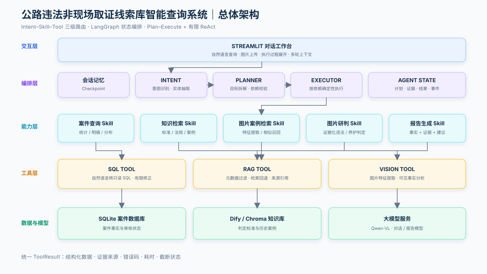
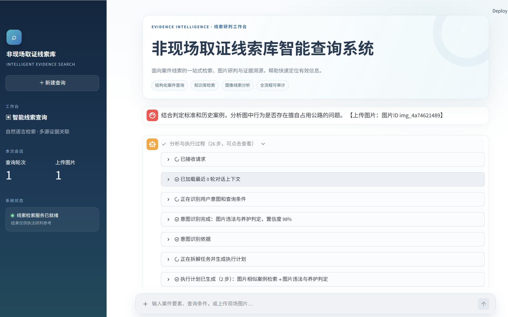
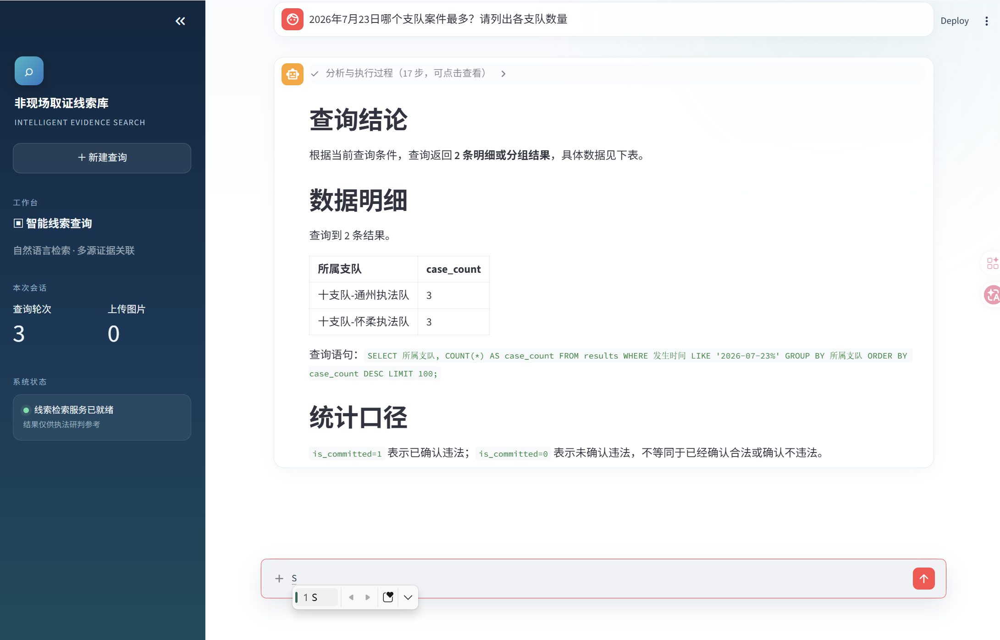
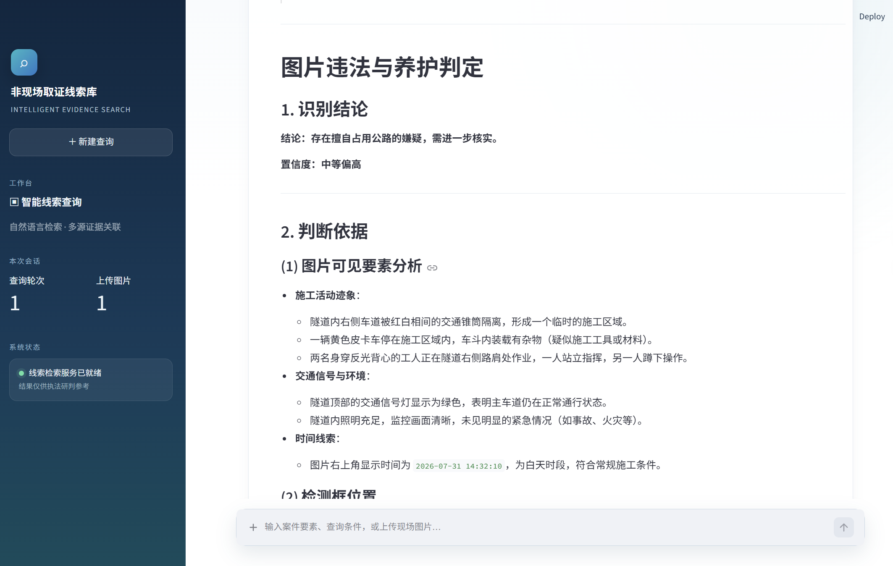
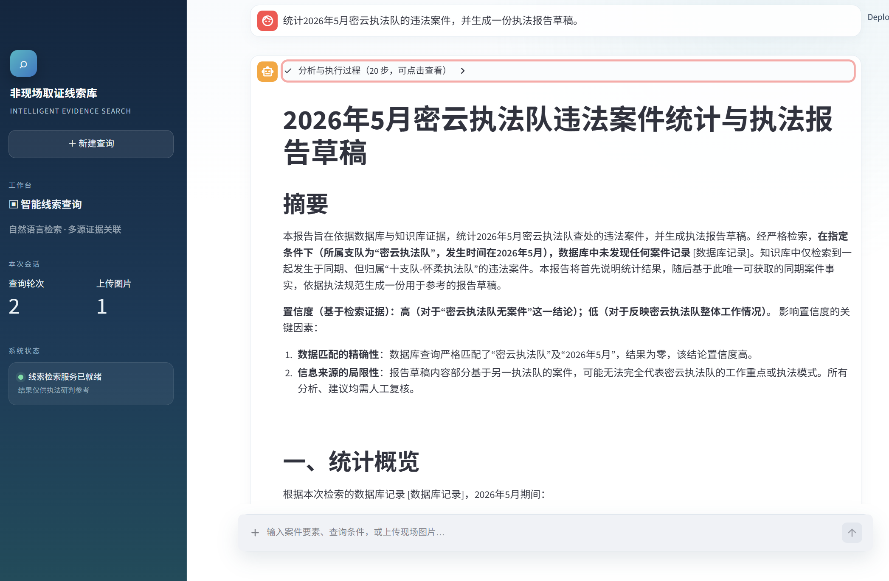

公路非现场取证的难点，并不是“有没有数据”，而是如何从大量案件记录、判定标准和现场图片中，快速找到能够支撑研判的线索。这个项目把结构化案件库、知识库和视觉模型接入同一个对话入口，让使用者可以直接用自然语言完成查询、检索、图片分析和报告生成。

> 系统定位是“线索检索与辅助研判”，不是自动执法。所有结论均需保留证据来源，并由人工或执法部门复核。

## 01｜项目背景：把分散的取证信息连起来

传统案件检索通常需要先理解数据库字段，再分别打开案件台账、法规文档和图片资料。遇到“查询某段时间的案件，再结合判定标准形成报告”这类复合需求时，还要跨多个系统手工整理。

这个项目主要解决三个问题：

- **结构化数据难查询**：业务人员不需要编写 SQL，直接描述时间、支队、地点或违法类型即可查询。
- **知识与案件相互割裂**：判定标准、历史案例和数据库事实可以在同一次回答中关联。
- **图片研判缺少依据**：视觉模型不只给出图像描述，还要先检索判定标准和相似案例，再形成带有证据边界的结论。

因此，系统没有把大模型当作一个无约束的聊天机器人，而是把它放进一套可规划、可校验、可追踪的业务流程中。

## 02｜项目目标与功能概览

系统以 Streamlit 提供文字与图片对话界面，后端围绕五类核心任务组织能力：

| 用户目标 | 系统能力 | 主要数据来源 |
| --- | --- | --- |
| 查询数量、明细或分布 | 自然语言转只读 SQL | SQLite 案件数据库 |
| 查询法规、标准与历史案例 | RAG 知识检索 | Dify / Chroma 知识库 |
| 根据图片寻找相似案例 | 视觉特征提取与案例召回 | Qwen-VL + 案例知识库 |
| 判断图片中的疑似违法行为 | 基于标准和案例的证据化研判 | 标准知识库 + Qwen-VL |
| 生成执法或取证报告 | 数据统计、证据检索与报告编排 | SQL + RAG + 大模型 |

用户面对的始终是一个统一输入框，但系统内部会根据问题切换完全不同的执行路径。输入“某天哪个支队案件最多”时，不会调用图片模型；上传图片并要求判定时，也不会绕过知识库直接下结论。

## 03｜系统总体架构

系统可以分成交互层、编排层、能力层和数据模型层。LangGraph 负责保存工作流状态并驱动节点流转，业务编排器则负责把用户目标转换成可执行计划。



每个 Tool 都返回统一的结构化结果，除业务数据外，还携带执行状态、证据来源、错误码、耗时和截断信息。上层 Skill 因而可以用一致的方式判断成功、回退或停止，而不必解析一段不可控的自然语言。

## 04｜Intent–Skill–Tool 三级路由

三级路由的核心，是把“用户想做什么”“业务上应该怎样做”和“底层具体调用什么”分开。

### Intent：识别目标和条件

Intent 层从问题中提取主意图、次级意图、置信度及时间、地点、支队、违法类型、图片 ID 等实体。系统目前覆盖案件查询、知识查询、图片案例检索、图片违法与养护判定、报告生成和一般对话。

例如问题“统计 2026 年 5 月密云执法队案件并生成报告”，主意图是报告生成，同时带有时间和单位两个约束。问题“先查找这张图片的历史案例，再判断是否违法”则包含两个存在前后依赖的目标。

### Skill：固化业务规则

Skill 不是简单的提示词名称，而是一个文件化的业务能力包。每个 Skill 都明确规定输入条件、工具顺序、结果格式和禁止行为。例如：

- 图片相似案例检索只能描述特征并返回案例，不能直接认定违法；
- 图片研判必须先取得标准或案例证据，再调用视觉模型；
- 报告生成必须执行 `SQL → RAG → 报告模型`，数据库失败时不得编造带数字的报告。

### Tool：完成原子操作

Tool 只负责单一、可验证的动作，包括只读 SQL 查询、知识库检索和图片分析。将原子工具与业务 Skill 分离后，模型不再临场决定所有调用顺序，关键业务约束可以通过代码和测试固定下来。

## 05｜ReAct 与 Plan–Execute 混合执行引擎

系统采用 **Plan–Execute 为主、Skill 内有限 ReAct 为辅** 的方式。

对于目标明确的单步请求，Planner 会直接生成一个 Skill 步骤；对于复合请求，则生成带依赖关系的执行计划。Executor 只执行依赖已满足的步骤，如果前置步骤失败，后续依赖步骤会停止或跳过。

```text
用户请求
   ↓
识别 Intent 与实体
   ↓
生成并校验 Execution Plan
   ↓
按依赖执行 Skill ──失败──→ 停止依赖步骤
   │
   └─局部失败→ 有限纠错 / 检索回退 / SQL 修正
   ↓
汇总结构化结果与证据
   ↓
生成最终回答并更新会话记忆
```

ReAct 只用于局部、可控的纠错循环，例如 SQL 生成失败后的有限修正，或知识检索结果不足时的查询改写。每个循环都设置最大次数，避免 Agent 无限思考、重复调用工具或产生不可预测的成本。

下面这次图片研判中，系统识别出“相似案例检索”和“图片违法与养护判定”两个目标，并自动生成两步依赖计划。



## 06｜五条核心业务链路

### 6.1 案件数据库查询

用户问题：**2026 年 7 月 23 日哪个支队案件最多？请列出各支队数量。**

系统将时间与统计维度转换成只读 SQL，在数据库执行后返回结论、数据明细和统计口径。示例结果显示十支队通州执法队与十支队怀柔执法队并列最多，同时将实际查询语句展示给用户，便于核验数据来源。



执行链路：`Case Query Intent → CaseQuerySkill → SQL Tool → 结构化回答`

### 6.2 法规与判定标准检索

对于“道路养护行为需要满足哪些条件”这类问题，系统进入知识查询 Skill，并使用 `doc_type=standard` 限定标准类文档。回答以召回片段为依据，将主体、目的、客体和程序等条件组织为可阅读的结论，并附带来源。

执行链路：`Knowledge Query Intent → KnowledgeQuerySkill → RAG Tool → 引用式回答`

### 6.3 图片相似案例检索

当用户要求“寻找类似历史案例”时，视觉模型先把图片转换为可检索的场景特征，包括道路环境、主体、物品、行为和空间关系，再到案例知识库中召回相似记录。该链路只负责提供历史参照，不越权输出违法认定。

执行链路：`Image Case Search Intent → ImageCaseSearchSkill → Vision Tool → RAG Tool`

### 6.4 图片违法与养护研判

用户问题：**结合判定标准和历史案例，分析图中行为是否存在擅自占用公路的问题。**

系统先检索相关标准与历史审核案例，再让视觉模型分析图片中的可见事实。最终回答区分“可直接观察的内容”和“仍然缺失的证据”，结论限定为确认违法、未确认违法或无法确定，避免把模型推测写成执法事实。



这次回答给出“存在擅自占用公路的嫌疑，需进一步核实”，并列出施工区域、车辆、人员、交通状态和时间等可见依据。相比直接输出“是或否”，这种表达更符合线索研判系统的职责边界。

执行链路：`Image Assessment Intent → ImageAssessmentSkill → RAG Tool → Vision Tool`

### 6.5 执法报告生成

用户问题：**统计 2026 年 5 月密云执法队的违法案件，并生成一份执法报告草稿。**

报告 Skill 先查询指定范围内的案件统计与明细，再检索相关标准，最后将数据库事实和知识库证据交给报告模型。输出包含摘要、统计概览、事实与证据、分析建议、不确定性和参考资料，并始终标记为需要人工复核的草稿。



示例中，数据库没有检索到符合“密云执法队 + 2026 年 5 月”的记录。系统没有补造统计结果，而是明确说明数据为空，并将知识库中其他支队的同期案例标记为有限参考。这种“没有数据也如实回答”的能力，比生成一份看似完整但无法追溯的报告更重要。

执行链路：`Report Generation Intent → ReportGenerationSkill → SQL Tool → RAG Tool → 报告模型`

从这五条链路可以看到，同一个对话界面背后并不是一条固定问答链，而是一套根据意图选择 Skill、由 Skill 约束 Tool、再由执行引擎管理依赖与状态的业务系统。
