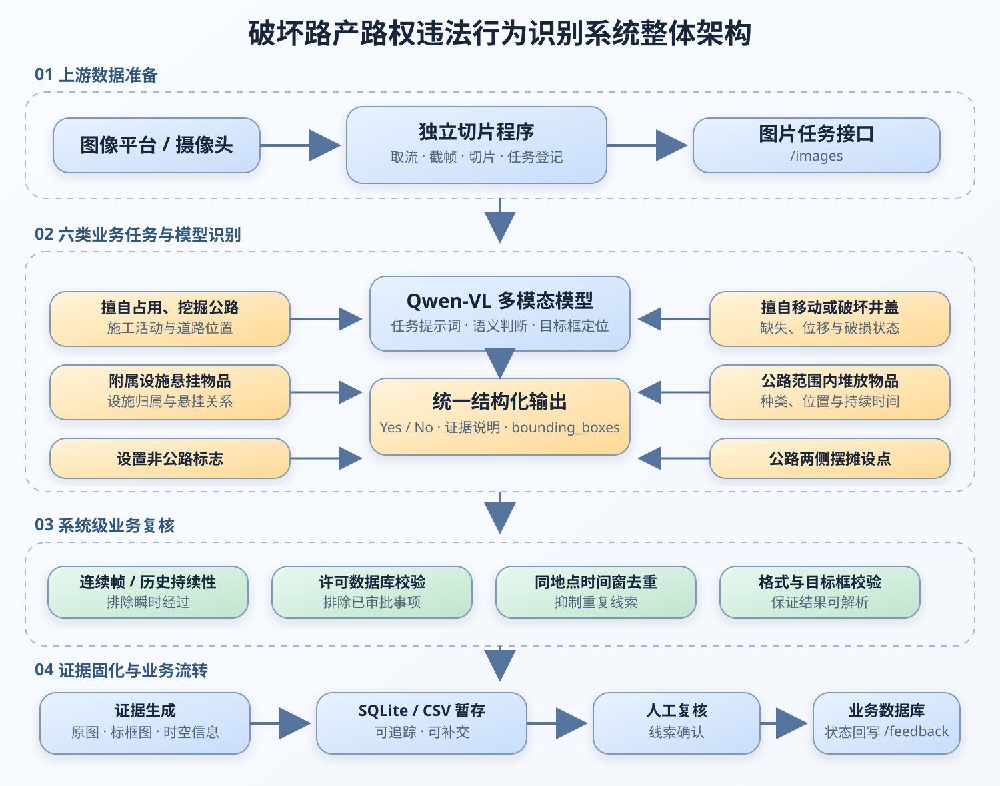
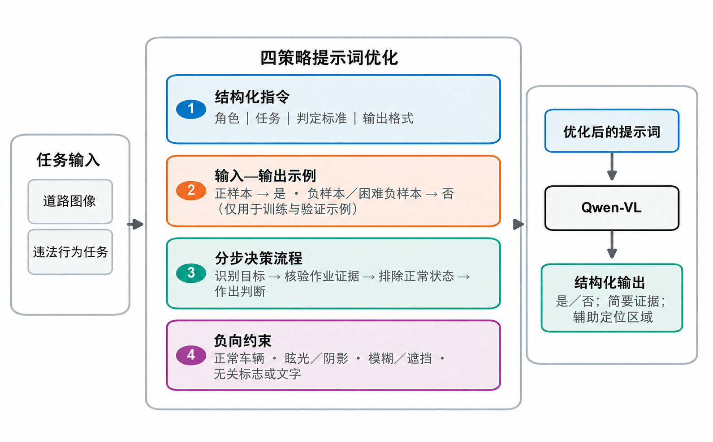
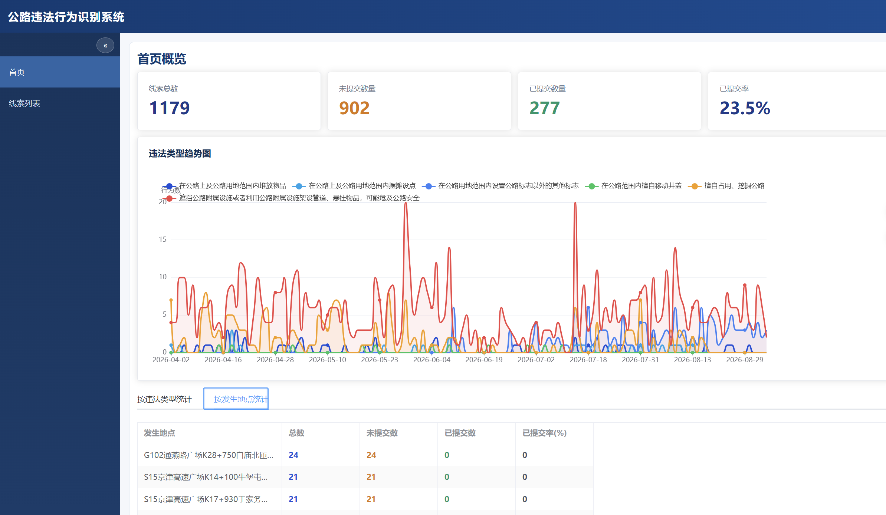
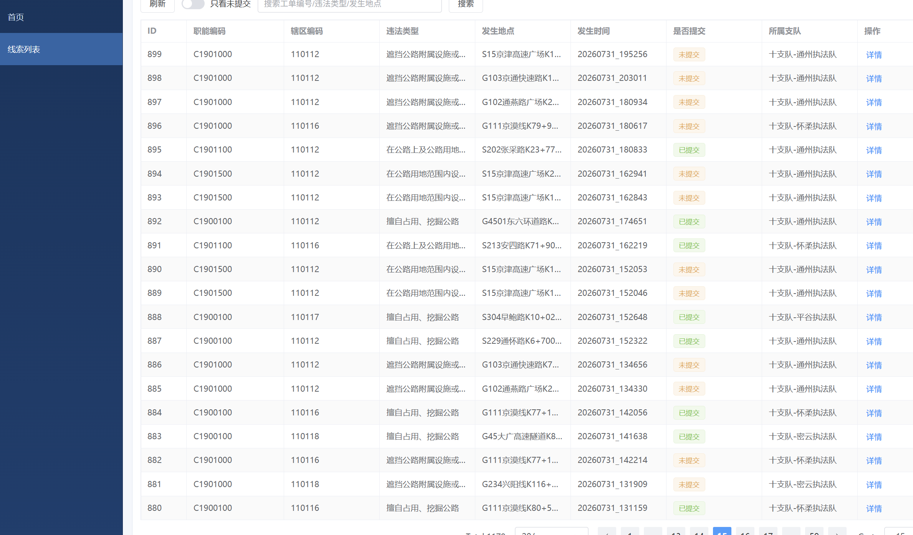
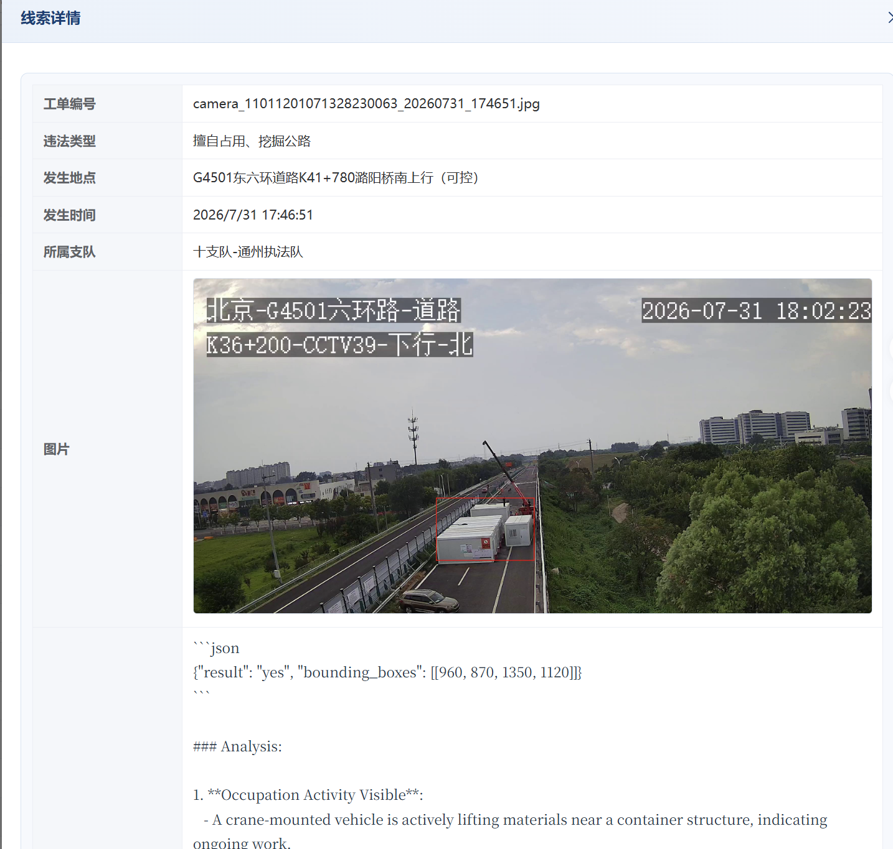
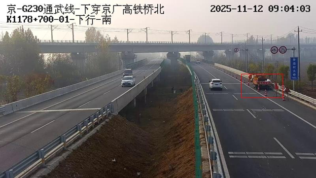
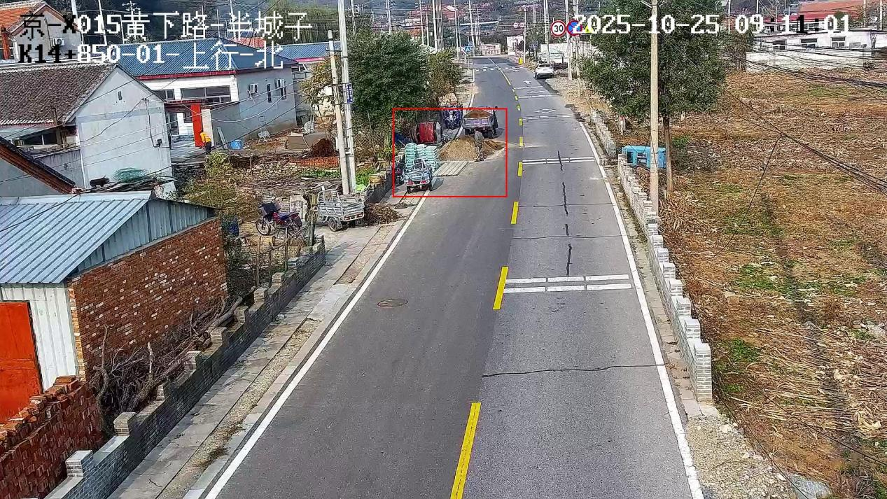

把一张道路监控图片交给视觉大模型，让它回答“有没有违法行为”，并不难。难的是让这个判断在数百个摄像头、全天候画面、真实执法口径和既有业务系统中长期运行。

这个项目面向公路非现场执法场景，识别擅自占用或挖掘公路、设置非公路标志、悬挂物品、井盖异常、堆放物品和摆摊设点等破坏路产路权行为。系统不是一个离线演示脚本，而是一条持续运行的生产链路：从独立切片服务接收图片，调用多模态模型识别，经过连续帧、许可与去重规则复核，保存证据并形成结构化线索，最终进入人工审核和业务数据库。

> 系统输出的是“疑似违法线索”，不是自动执法结论。模型负责筛查和定位，规则负责降低误报，最终认定仍由业务人员完成。

## 01｜项目背景：让违法线索发现从人工巡查走向智能筛查

传统公路巡查依赖人员巡检、定点值守和人工回看视频。面对覆盖广、点位多、违法行为持续时间短的现实环境，人工很难持续关注全部画面。即使模型能在单张图片上取得不错的结果，进入生产环境后仍会遇到新的问题：

- 同一个点位短时间内重复产生大量相似告警；
- 货车、护栏、交通锥和正常养护容易被误认为施工；
- 加油站、农家院等合法经营场景可能与路边摆摊相似；
- 合法占掘或经审批设置的标志不能作为违法线索上报；
- 夜间、雨雪、反光、遮挡和压缩失真会放大模型的不确定性；
- 模型结果必须转换为既有系统可接收的工单字段和证据图片。

因此，项目沿着两条主线同步推进：一方面通过提示词优化、困难样本积累和LoRA微调，持续提升模型对真实公路场景的识别能力；另一方面建设可持续运行的线索生产系统，由模型完成大范围智能筛查，程序补充时间与许可信息，人工对高价值结果进行复核。

## 02｜系统整体架构

系统由视频数据准备、违法行为识别、业务规则复核、证据固化和线索流转等环节组成。各环节通过任务状态和结构化字段衔接，使模型推理、业务判断与下游处置能够分别运行和独立维护。

这张架构图沿用项目验收研究报告“六个违法行为识别技术路线图”的表达方式，并结合实际部署流程重新整理。系统先接收图像任务，再按照六类违法行为调用Qwen-VL完成语义判断与目标定位，随后经过连续帧、许可、去重和格式规则复核，最终生成证据、暂存线索，经人工确认后进入下游业务链路。

### 2.1 视频数据准备

上游视频取流、截帧和切片方案仍在进一步确认，本节暂不展开具体实现，后续根据实际程序补充。

### 2.2 图像任务解析与调度

识别服务获取待处理任务后，首先读取图片地址、摄像头编号、点位名称、采集时间和任务状态等元数据，并检查图片是否能够正常读取。任务随后根据摄像头覆盖范围和违法类型配置进入不同的识别队列。对高发、时效性强的行为提高检查频率，对相对稳定或低频的目标降低轮询频率，在有限算力下平衡覆盖范围与响应速度。

进入模型前，程序统一图像格式并保留原始分辨率信息。原始尺寸不会被丢弃，因为模型返回的是归一化坐标，后续仍需依靠宽高信息把目标框映射回证据图片。读取失败、图像损坏或元数据不完整的任务会记录异常并按约定更新状态，避免单条错误阻塞整个处理队列。

### 2.3 多模态模型识别

模型识别阶段同时输入道路图像和该违法类型对应的文本指令。Qwen-VL的视觉模块负责提取车辆、人员、施工设备、标志牌、护栏、井盖、摊位和堆放物等视觉特征，语言模块负责理解执法规则、成立条件和排除条件，多模态融合过程再建立“目标是什么、位于哪里、正在发生什么、是否满足规则”之间的联系。

六类任务使用相互独立的提示词，而不是让一个宽泛问题同时判断所有行为。例如，占用挖掘任务重点核验施工活动、人员、设备和道路区域之间的关系；悬挂物任务判断物品是否依附于公路附属设施；非公路标志任务还需要读取牌面文字并理解其用途；井盖任务识别缺失、移动或破损状态；堆放与摆摊任务则结合物体、人员和道路空间关系作出判断。

不同任务共享统一的输出协议。确认存在目标时，模型返回 `result=yes`、简要证据说明以及归一化到 `1000×1000` 坐标系的 `bounding_boxes`；不确定、画面质量不足或未满足完整条件时返回 `result=no`。这种固定格式把自然语言推理结果转换成程序可以稳定解析的数据，也为后续规则复核提供一致入口。

### 2.4 识别结果解析与目标定位

模型响应返回后，程序先清理代码块标记等非必要内容，再解析JSON并校验关键字段。对于肯定结果，系统检查目标框的坐标顺序、数值范围和最小尺寸，过滤无效框或明显异常框；随后按照原图宽高将归一化坐标还原到实际像素位置，在原始证据图上绘制目标区域。

目标框不仅用于界面展示，也是连续帧复核的重要依据。系统可以通过前后图像中目标框的空间重合程度判断是否为同一对象，从而区分车辆或人员短暂经过与目标持续占用道路的情况。模型结论、原始响应和解析后的结构化字段会同时保留，便于出现误报时追溯到底是模型判断、格式解析还是业务规则造成的问题。

### 2.5 业务规则复核

单帧模型命中后不会立即形成最终线索。占用挖掘等行为需要再次获取后续图像，确认相关对象和作业状态持续存在；堆放物品、摆摊设点等任务会查询同地点、同类型的历史记录；可能经过审批的涉路施工和非公路标志还要结合许可期限、业务名称与地点信息进行校验。系统同时设置防抖时间窗，避免同一事件在短时间内被重复上报。

这些规则补充了图像之外的事实。视觉模型能够判断画面“像不像”某类行为，却无法仅凭图片确认行为持续了多久、是否取得许可、此前是否已经形成线索。把时序、审批和历史状态放到程序侧处理，可以让模型专注于视觉语义理解，也使业务规则能够独立调整。

### 2.6 线索要素提取与结果流转

通过复核的结果进入证据固化阶段。系统保存原始图片和标框图片，并组织工单编号、违法类型、发生时间、监控点位、地理位置、所属支队、模型说明和目标坐标等字段。不同任务还会保留相应的业务要素，例如施工活动所在区域、悬挂物所依附的设施、标志牌文字、堆放物种类以及摊位与道路通行空间的关系。

结构化线索先写入CSV和SQLite暂存，再进入内部管理界面供人工核查。审核通过后，线索按照下游字段要求进入业务数据库，并向任务接口回写处理状态。若模型服务或下游数据库短时异常，本地状态和暂存记录能够支持重试与补交，避免已经完成的图片分析和证据信息丢失。

## 03｜业务规则：识别的不是物体，而是行为

公路违法识别与普通目标检测最大的区别，是“看见某个物体”并不等于“违法行为成立”。挖掘机、货车、广告牌、摊位和垃圾桶都可能合法存在，模型必须同时理解对象、位置、状态和上下文。

### 3.1 六类识别任务及其业务依据

项目围绕六类破坏路产、侵犯路权行为建立识别任务：擅自占用或挖掘公路，遮挡公路附属设施或利用其悬挂物品，在公路用地范围内设置非公路标志，擅自移动或破坏井盖，在公路及公路用地范围内堆放物品，以及摆摊设点。

这些任务不是按视觉类别随意划分，而是从实际执法事项中抽取。占用、挖掘公路需要结合是否取得涉路施工许可判断；非公路标志需要识别设置位置、标志性质与审批状态；悬挂物品和井盖异常涉及公路附属设施的完整性与安全性；堆放物品和摆摊设点则需要判断是否位于公路或公路用地范围内，以及是否造成损坏、污染或影响通行。

因此，系统只输出疑似违法线索和可核查证据，不直接替代行政执法认定。模型负责从画面中发现对象、行为与位置关系，程序结合时间和许可信息进行复核，业务人员再依据现场证据和法律规定作出判断。

### 3.2 将执法口径写进提示词

项目把每类提示词拆成四个稳定部分：`Role`、`Task`、`Criteria` 和 `Output Format`。在此基础上加入分步判断与负向约束，让模型先寻找目标，再确认行为证据，随后排除正常状态，最后才给出结论。

例如，占用或挖掘公路不是“画面里有黄色工程车”就成立，而是要求同时观察到正在发生的占掘活动、围挡或土堆等施工迹象，以及参与或指挥作业的人员；警车、救护车、正常道路养护和仅仅停放或行驶的大型车辆必须排除。

摆摊设点要求摊位与经营人员同时出现；车辆正常运输的货物不算摆摊。堆放物品要排除交通锥、水马、防撞桶等规则排列的交通安全设施，也要排除仍在车辆上的货物。非公路标志不仅要定位牌体，还要读取文字并区分交通、地点、公共事务信息与商业或个人事务信息。

提示词还采用“保守拒判”：模糊、遮挡、逆光或证据不足时输出否，而不是依靠猜测制造线索。对执法辅助系统而言，输出稳定、可解析和边界明确，往往比生成一段看似聪明的解释更重要。

### 3.3 用时间维度修正单帧判断

单张图像只能说明某一瞬间发生了什么。项目根据违法类型设计了不同的复核方式：

- **占用或挖掘公路**：首次命中后再次获取后续帧，第二次仍然命中才进入上报流程；
- **堆放物品与摆摊设点**：查询同地点、同类型的历史记录，在设定时间范围内持续出现时才生成线索；
- **非公路标志等稳定目标**：允许按单帧结果进入后续规则；
- **通用去重**：同地点、同违法类型在防抖时间窗内只保留一次有效上报。

目标框的IoU匹配进一步判断前后帧中的对象是否位于相近区域。这样可以区分临时经过的车辆、人员与长期占用道路的物体。

### 3.4 让审批信息参与判断

对于占掘公路、设置非公路标志等可能存在合法审批的事项，模型命中只是第一关。程序还会查询许可数据库，按业务名称、许可期限和地点信息检查当前行为是否已有许可。存在有效许可时中止上报。

这一步揭示了项目落地中的关键事实：图像本身无法包含全部法律事实。视觉模型判断“像不像目标行为”，许可库回答“该行为是否已经获批”，两者结合后才适合作为线索筛查依据。

### 3.5 从模型结果提取执法线索要素

模型识别结束后，系统并不只保存一个“是”或“否”。每条有效线索还要关联违法类型、发生时间、监控点位、地理位置、目标框和证据图片，并根据任务补充专属要素：占用挖掘关注施工活动及其所在道路区域；悬挂物品关注所依附的护栏、标志牌等设施；非公路标志关注牌体文字和标志性质；堆放物品关注物品种类及是否占用车道、路肩或设施周边；摆摊设点则关注摊位、经营人员与道路通行空间的关系。

这些信息经过统一结构化后写入本地结果库，为工单生成、条件检索、人工复核和后续追溯提供数据基础。由此，模型输出才从一次视觉判断转化为业务系统能够接收和处理的线索记录。

## 04｜模型研发：从早期7B验证到大模型持续迭代

### 4.1 模型不是一次选型，而是一条持续演进的路线

基础模型需要同时具备图像理解、中文语义、文字读取、空间定位和结构化输出能力，还必须适配现有算力与私有化部署环境。项目并没有把某个模型版本作为固定终点，而是随着Qwen系列能力和部署条件变化持续更新：从Qwen2.5逐步迭代到Qwen3、3.5、3.6和3.8，并在后续实际使用中采用72B、32B、27B等更大参数规模的模型。

Qwen2.5-VL-7B是项目最开始用于验证提示词、数据格式、LoRA训练和昇腾适配的测试版本。它的价值在于以较低成本快速跑通研究链路，而不是代表项目后期的生产模型规模。随着业务样本和算力条件成熟，团队转向更大模型，并持续将线上误报、漏报和新场景反馈到后续版本。

早期训练代码运行在华为昇腾Ascend 910B环境中。训练侧加载图像与对话式监督数据，将LoRA插入注意力层及MLP线性模块，包括 `q_proj`、`k_proj`、`v_proj`、`o_proj`、`gate_proj`、`up_proj` 和 `down_proj`。这套早期实验为后续不同尺寸、不同代际模型的评估与替换建立了统一的数据和指标基线。

### 4.2 数据不是“图片越多越好”

训练材料来自固定道路监控、实际违法案例、网络补充图片和测试场数据。最终整理约2万条图文样本，其中正样本约60%、负样本约40%。四项重点任务的正样本占比保持相对均衡：占用或挖掘公路23.55%、非公路标志23.13%、堆放或悬挂物品25.48%、摆摊设点27.84%。

固定监控部分覆盖431个独立交通场景和约一年的采集周期。数据清理时剔除传输损坏、严重模糊、遮挡以及连续重复帧，并按场景而不是按图片随机划分训练集、验证集和测试集，比例为70% / 15% / 15%。同一场景的不同摄像头视角只进入一个子集，避免相邻帧泄漏让测试指标虚高。

样本构建采用“强模型预标注 + 人工复核”：Qwen2.5-VL-72B先生成是否违法、目标位置和语义描述，人工再修正误检、漏检与定位偏差。更重要的是，线上误报会回流为困难负样本，例如：

- 黄色货车被误认为挖掘机；
- 公路护栏被误认为施工围挡；
- 正常交通标志被判为非公路标志；
- 光斑、阴影和低照度区域被识别成目标物；
- 加油站、农家院等相似经营场景被识别为摆摊。

这些“长得像但不成立”的样本，比大量简单负样本更能帮助模型学习业务边界。

### 4.3 LoRA配置与训练策略

在Qwen2.5-VL-7B早期研究实验中，项目采用固定LoRA配置进行领域适配：`r=64`、`lora_alpha=16`、`lora_dropout=0.05`。训练脚本使用单卡批次4、梯度累积4步、训练2个epoch、学习率`1e-4`，并开启梯度检查点；该阶段实验在2张Ascend 910B上完成。

优化器使用AdamW，配合权重衰减、线性学习率衰减、100步warmup、梯度裁剪与混合精度训练。训练只更新LoRA低秩参数，底座权重保持冻结，因此可以用远低于全参微调的资源学习公路场景特征，并以独立适配器形式加载到推理服务。

这组参数是当前数据与硬件条件下的工程选择，并不意味着 `r=64` 是所有场景的理论最优值。项目更关注稳定复现和可部署性，而不是无边界地搜索超参数。

### 4.4 Prompt与LoRA各自解决什么

结构化Prompt主要解决“判定规则是什么”：要求模型关注哪些证据、排除哪些干扰、怎样返回结果。LoRA主要解决“这些证据在真实道路画面中长什么样”：护栏与围挡的差异、正常货车与作业机械的状态差异，以及中文标志文字的领域语义。

两者不是替代关系。在早期Qwen2.5-VL-7B对照实验中，Prompt先把基础模型的F1从48.68%提高到60.59%，LoRA再在相同结构化Prompt上将F1提高到87.69%。这说明业务口径可以通过指令快速注入，但要稳定识别复杂、细粒度的道路视觉特征，仍需要领域数据和模型迭代共同发挥作用。后续使用72B、32B、27B等模型时，这套方法继续作为提示词设计、样本回流和版本评估的基础，而不是把早期7B实验结果直接当作所有后续模型的性能结论。

## 05｜线索管理：内部界面服务于验证与运维

项目仓库内提供了一套Vue 3 + FastAPI的线索管理界面，用于开发、测试和运维核查，并非正式项目门户；正式业务界面由下游系统承载。下面展示的是项目实际使用的内部管理页面，可以直观看到线索从统计汇总、列表检索到详情核查的流转过程。

首页集中展示线索总量、提交情况、提交率和违法类型趋势，便于运维人员快速判断任务运行状态与线索分布。

线索列表把工单编号、违法类型、发生时间、位置、所属支队和提交状态放在同一视图中，并提供筛选、搜索和详情入口。

详情页保留结构化业务字段、现场证据图片和模型原始输出，帮助运维人员核验模型判断及其依据。

内部界面读取本地SQLite的 `results` 表，提供线索总量、未提交量、已提交量、提交率、违法类型趋势，以及按违法类型或发生地点的聚合统计。线索列表支持“只看未提交”和工单编号、违法类型、地点关键词搜索；详情页展示发生时间、所属支队、证据图片和模型原始输出，经人工确认后再提交。

数据侧采用“先暂存、后提交”的策略：识别结果同时保留在CSV和SQLite中，图片通过独立预览服务提供访问。即使下游数据库暂时不可用，识别任务仍可继续运行，待连接恢复后再推送，避免模型算力和现场图片被白白消耗。

## 06｜效果评估：分清线上预警与离线模型指标

项目早期并不理想。2025年4月9日至15日的一次占用、挖掘公路线上核查中，共产生8起预警，人工确认2起正确、6起误判，预警正确率仅25%。其中一个典型问题，是模型把等待行驶的黄色货车识别为施工机械。

针对这些问题，团队沿着三条路径持续优化：一是完善提示词中的成立条件、排除项和结构化输出；二是将误报、漏报案例回流为困难样本，用于后续数据集建设与模型微调；三是在模型之外增加连续帧、许可校验和时间窗去重等业务复核。三条路径的具体方法前文已经展开，它们分别改善模型的判断口径、真实场景辨别能力和系统级线索质量。

在此基础上，项目持续更新模型版本并调整参数，将每轮运行中发现的问题重新反馈到提示词、数据集和业务规则中，形成“运行—复核—归因—优化—再验证”的迭代闭环。经过多轮优化，最终在六类破坏路产路权违法行为样本集上进行测试，结果如下：

| 违法行为 | TP | FP | FN | TN | 准确率 | 查全率 | 查准率 |
| --- | ---: | ---: | ---: | ---: | ---: | ---: | ---: |
| 擅自占用、挖掘公路 | 108 | 6 | 12 | 44 | 89.4% | 90% | 94% |
| 设置公路标志以外的其他标志 | 79 | 8 | 8 | 5 | 84.0% | 91% | 91% |
| 擅自移动井盖 | 83 | 5 | 6 | 16 | 90.0% | 93% | 94% |
| 遮挡或利用公路附属设施悬挂物品 | 74 | 7 | 8 | 11 | 85.0% | 90% | 91% |
| 公路上及公路用地范围内堆放物品 | 75 | 5 | 7 | 23 | 89.1% | 91% | 94% |
| 公路上及公路用地范围内摆摊设点 | 83 | 4 | 9 | 24 | 89.2% | 90% | 95% |

表中的查全率和查准率采用验收研究报告表2-19至表2-24的原始结果；准确率根据各表混淆矩阵按 `(TP + TN) / (TP + FP + FN + TN)` 计算。六类任务的准确率均达到84%以上，查全率均达到90%以上，查准率均达到91%以上。

### 6.1 实现效果

在实际应用场景中，模型已实现对破坏路产路权6类典型违法行为的智能识别与自动取证，能够在监控画面中检测并定位擅自占用或挖掘公路、利用公路附属设施悬挂物品、违规设置非公路标志、擅自移动或破坏井盖、在公路用地范围内堆放物品，以及在公路两侧摆摊设点等行为。

系统结合目标物体的空间位置、持续时间和行为特征进行综合研判。识别出疑似违法行为后，上游取证链路截取相关视频片段或关键帧，系统在证据画面中标注目标区域，并关联违法类型、发生位置和发生时间等信息。同时生成结构化事件记录，将时间戳、地理位置与高清图像证据组织在一起，使违法线索可追溯、可举证、可复核。

这套技术提升了路政执法的主动发现能力和响应效率，弥补了传统人工巡查在覆盖范围、持续值守和现场取证方面的不足，为维护公路路产路权和保障道路安全畅通提供数字化执法依据。

*图：占用、挖掘公路行为检测效果。系统在监控画面中定位疑似作业区域。*

*图：公路用地范围内堆放物品行为检测效果。目标框标出了路侧堆放区域。*

## 07｜部署与运维：让模型可以长期工作

识别服务、模型服务和内部线索界面均采用容器化部署。主程序启动后并行运行图片托管、历史图片清理、定时数据推送和多频率识别线程。生产维护重点不是偶尔手工执行一次推理，而是保证几个边界持续可靠：

- 图片切片接口能否持续返回任务并正确接收处理反馈；
- 模型服务是否稳定返回可解析JSON，目标框是否有效；
- 图片证据、SQLite记录和数据库字段是否保持一致；
- 下游数据库异常时是否暂存，恢复后是否可以补交；
- 日志、容器健康状态、磁盘占用和历史图片清理是否正常；
- 模型、接口和数据库凭据是否通过部署配置注入，而不是写进公开代码。

系统设置夜间静默时段，并自动清理超过保留期限的原图。线索表保留工单编号、发生时间、地点、违法类型、所属支队、证据图片、模型输出与提交状态，使每一次模型判断都能被查询、复核和追踪。

## 结语：落地不是把模型接上接口

这个项目最重要的经验，是把模型能力与业务事实分开处理：

- 图像切片解决“什么时候、从哪里取数据”；
- 多模态模型解决“画面是否像目标行为、目标在哪里”；
- Prompt固化成立条件和排除边界；
- LoRA让模型学习真实道路中的领域特征；
- 连续帧、许可和去重规则补足单帧图像之外的事实；
- 人工复核与数据库提交完成责任闭环。

因此，真正可用的AI系统不是一个精度数字，也不是一个聊天界面，而是一组能够在现实约束下共同工作的组件。模型把海量视频变成少量候选线索，工程规则把候选线索变得更可信，最终仍由人完成判断与处置——这才是多模态大模型进入公路执法场景的合理位置。
