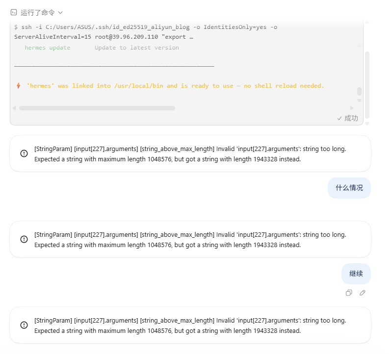

在对远程服务器进行SSH操控并安装Hermes时，出现了 **Codex 某次工具调用的参数字符串过大**的问题。

报错已经给出了准确数字：

```text
Invalid 'input[227].arguments': string too long.
Expected a string with maximum length 1048576,
but got a string with length 1943328 instead.
```

接口最多允许 `1,048,576` 个字符，但实际提交了 `1,943,328` 个字符，约为上限的 1.85 倍。请求因此在送到模型继续处理之前，就被参数校验直接拒绝并返回 HTTP 400。



## 当时看起来像什么

在原任务里，Codex 正通过 SSH 安装 Hermes，并不断检查进程、内存、网络和日志。安装命令本身已经成功执行，界面也显示命令成功。

紧接着，当模型对Hermes进行模型配置时，对话开始反复出现同一个错误。即使输入“什么情况”或“继续”，仍然立即失败。站在使用者角度看，很像 Codex 对话突然“宕机”了。

但经过检查：
- SSH 可以正常连接。
- 服务器仍在运行。
- 博客容器没有停止。
- Hermes 的安装进程和网络连接都存在。
- 内存当时仍有约 1.1 GiB 可用，并没有发生 OOM。

所以，服务器正在做它该做的事，真正卡住的是这条 Codex 对话的请求载荷。

## `input[227].arguments` 是什么意思

一次 Agent 请求不只有用户刚输入的一句话。为了让模型知道之前做过什么，系统还会带上对话历史、工具调用以及工具返回结果。

`input[227]` 可以理解为本次请求携带的第 228 个输入项，`arguments` 是其中一次工具调用的参数字段。这个字段最终必须被序列化成字符串再提交给接口。

问题并不是用户输入的“继续”太长，而是历史中的某个工具参数已经膨胀到接近 194 万字符。新消息会沿用原任务的历史，因此每次重试都把同一个超大字段再次提交，随后在同一个位置失败。

## 参数为什么会膨胀

结合当时的操作记录，任务长时间执行了多轮 SSH 命令，并收集了进程列表、安装信息、配置检查和大量日志。某些命令或调用在构造参数时包含了很长的文本，最终让单个 `arguments` 字段越过接口限制。

这里需要区分三个容易混淆的概念：

1. **用户消息太长**：用户一次粘贴了超大文本。
2. **模型上下文太长**：所有历史 Token 的总量超过模型上下文窗口。
3. **工具参数太长**：某个结构化字段超过接口对单个字符串的长度限制。

这次错误明确指向第三种。它和上下文总 Token 数有关联，但并不是常见的“上下文窗口用完了”。即使模型上下文还有空间，单个工具参数超过 1 MiB 字符上限，接口也会拒绝请求。

## 为什么发送“继续”无法恢复

“继续”只是增加一条新的用户消息，并不会删除出错的历史工具调用。

可以把一条任务想成一个需要整体提交的档案袋。档案袋里已经塞进一份超大附件，每次说“继续”，只是再放进一张小纸条；那份超大附件仍在，所以档案袋每次都会在同一道检查处被退回。

因此，这类错误通常不是多点几次重试就能解决的。截图里三次错误内容和字符数完全相同，也说明系统一直在重复提交同一个超限参数。

## 正确的恢复办法

### 1. 新建任务接管

最直接的办法是创建一个干净任务，只带入必要的状态摘要，不复制那段巨大的工具参数。例如只说明：

```text
服务器地址和目标不变。Hermes 安装已启动，请重新检查进程、内存、磁盘和服务状态，然后从当前状态继续。
```

新任务没有损坏的历史字段，可以重新连接服务器并继续排查。

### 2. 先重新读取真实状态

不要完全相信旧任务最后一条输出，因为远程状态可能已经变化。新任务应重新执行小而明确的检查：

```bash
ps aux
free -h
df -h
docker ps
systemctl status <service>
```

这样才能判断安装是仍在运行、已经完成，还是确实失败。

### 3. 用摘要交接，不要搬运完整日志

交接内容只保留：

- 已完成了什么。
- 当前正在运行什么。
- 已确认哪些服务正常。
- 最后一条真正有效的错误是什么。
- 下一步需要验证什么。

几十行摘要通常比几十万字符的原始输出更有用。

## 如何避免再次发生

### 限制命令输出

远程排查时，不要无上限地读取日志。优先使用：

```bash
journalctl -u <service> -n 100 --no-pager
docker logs --tail 100 <container>
head -n 100 <file>
tail -n 100 <file>
```

### 把大结果留在文件里

如果必须生成完整日志，可以把它保存在服务器或工作区文件中，再用 `grep`、`rg`、`sed` 等工具按需读取小片段。不要把整个文件内容塞进下一次工具参数。

### 拆分长命令

把“安装、检查、迁移配置、打印日志、验证服务”全部塞进一条 SSH 命令，参数很容易变得又长又难排查。拆成多个目标单一的调用，失败位置更清楚，返回内容也更容易控制。

### 定期压缩任务上下文

长时间部署任务应在关键阶段形成简短检查点，例如“系统依赖完成”“Python 依赖完成”“服务文件完成”“网关验证完成”。任务变得过长时，用这些检查点在新任务里续接。

### 避免重复提交确定性错误

如果每次都出现相同字段、相同上限和相同实际长度，说明错误具有确定性。此时继续重试只会得到相同结果，应立即换用新任务或移除超大历史载荷。

## 一套简单的判断顺序

遇到 Codex 突然不再回答，可以按下面顺序判断：

```text
界面报错
  ↓
看 HTTP 状态码和具体字段
  ↓
出现 string_above_max_length？
  ├─ 是：工具参数超限，换新任务并摘要接管
  └─ 否：继续检查网络、权限、命令退出码和远程服务
  ↓
从新任务重新读取服务器真实状态
```

不要看到对话失败，就立刻重启服务器。先判断错误发生在本地客户端、Agent 请求、SSH 链路，还是远程服务内部。层级判断错了，重启不仅无效，还可能中断本来正常运行的安装进程。

## 这次故障的最终定性

这次故障可以准确描述为：

> 长时间 Agent 操作产生了过大的工具调用参数。该参数随历史记录反复进入后续请求，超过接口的单字符串长度限制，导致请求连续返回 HTTP 400，原任务无法自行继续。

它不是服务器宕机，也不是博客容器故障。真正有效的处理方式，是在新任务中用精简摘要接管，并重新检查服务器的当前状态。

