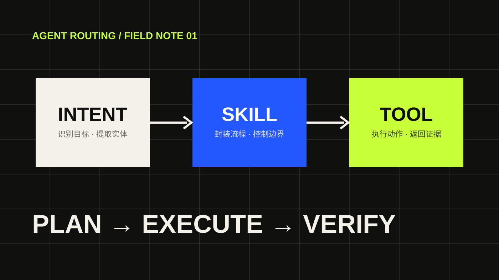

一个面向真实业务的 Agent，不能只靠一段不断变长的系统提示词。随着工具数量增加，我们需要明确回答三个问题：用户想完成什么、应该调用哪套能力、最终由哪个工具执行。

> 这是一篇用于展示博客排版和文章结构的示例文章。你可以直接替换正文，也可以复制整个目录创建新文章。

## 为什么需要三级路由

当查询同时涉及数据库、知识库和视觉模型时，单层 Tool Calling 很容易出现工具误选、参数缺失和执行顺序错误。



三级路由将职责拆开：

- **Intent**：识别用户目标并提取实体。
- **Skill**：封装一个完整的业务能力和执行边界。
- **Tool**：执行 SQL、知识检索或模型调用等原子动作。

## 定义 Agent 状态

状态需要容纳用户请求、结构化实体、执行计划与历史结果：

```python
class AgentState(TypedDict):
    user_query: str
    intents: list[str]
    entities: dict[str, object]
    plan: list[dict[str, object]]
    evidence: list[dict[str, object]]
    final_answer: str
```

不要把完整图片和全部 Tool 原始响应无限写入状态。保存图片 ID、来源 ID 和摘要通常更合适。

## 选择执行机制

简单任务可以直接执行对应 Skill；存在依赖关系的复合任务，则先生成计划，再按依赖顺序执行。对于 Skill 内部的小范围不确定性，可以使用有界 ReAct 进行参数修正或检索回退。

## 验收标准

一个可维护的路由系统至少应该验证：

1. 单一意图能够稳定命中正确 Skill。
2. 多意图任务生成的执行计划依赖正确。
3. 工具异常不会破坏整个会话状态。
4. 最终回答可以追溯到实际证据来源。

## 小结

Intent-Skill-Tool 的价值不在于增加名词，而在于让分类、业务编排和底层调用分别拥有清晰边界。
